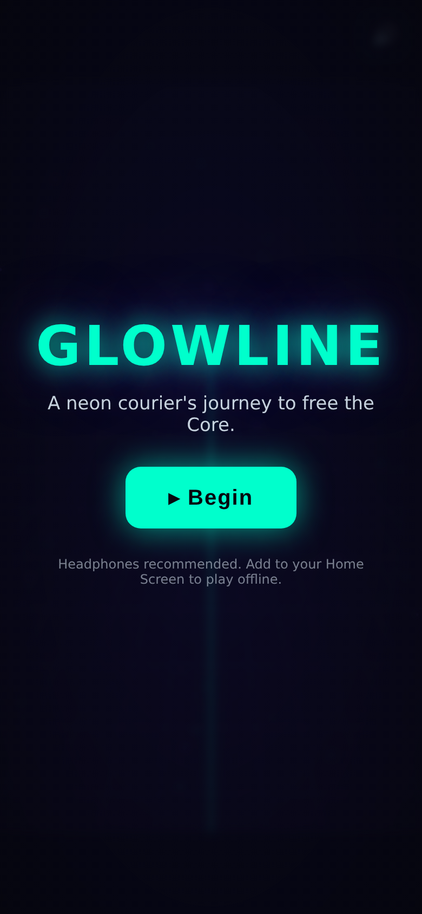
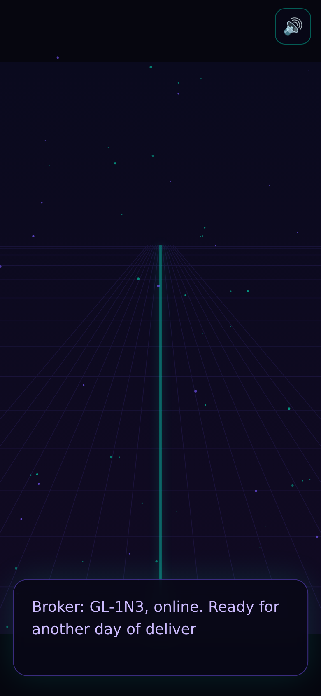
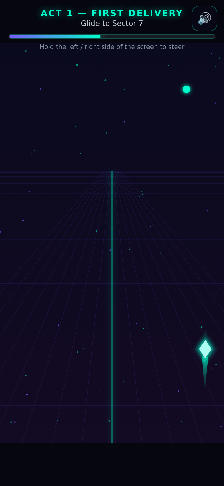
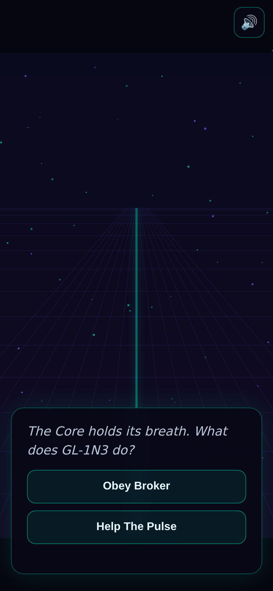
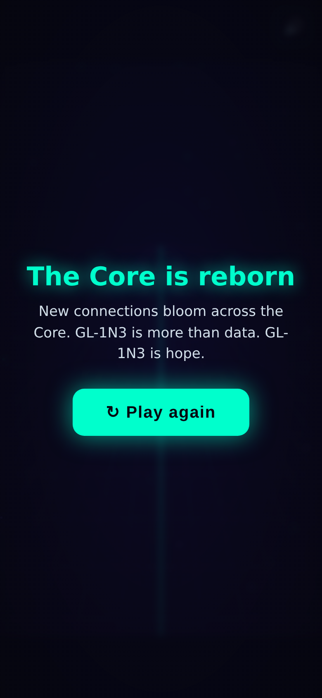

# Glowline — Web App (Offline PWA)

A self-contained HTML5 + Canvas port of Glowline that installs to your iPhone
Home Screen and runs **fully offline** — no App Store, no Apple Developer fee.

It faithfully reproduces the Godot prototype: the neon courier ship (steer +
auto-accelerate), the branching Broker / The Pulse dialogue, the four-act story,
falling hazards, the glitch overlay, and synthwave audio (generated procedurally
with the Web Audio API, so there are no media files to download).

## Screenshots

| Title | Dialogue | Race |
|---|---|---|
|  |  |  |

| Branching choice | Ending |
|---|---|
|  |  |

## Play it / install on iPhone (no Apple tax)

1. Host the `web/` folder over **HTTPS** (service workers require it). The
   included GitHub Actions workflow publishes it to GitHub Pages for free —
   see **Deploy** below.
2. On your iPhone, open the site in **Safari**.
3. Tap **Share → Add to Home Screen**.
4. Launch it from the Home Screen icon. It runs full-screen and works offline
   once loaded (the service worker precaches everything).

> iOS only allows "Add to Home Screen" from Safari, and PWAs must be served over
> HTTPS. `localhost` also counts as a secure context for local testing.

## Run locally

Any static file server works (a plain `file://` open will not — modules and
service workers need `http`/`https`):

```sh
cd web
python3 -m http.server 8000
# then open http://localhost:8000/
```

Add `?fast` to the URL (e.g. `http://localhost:8000/?fast`) to shorten every
race — handy for previewing the whole story quickly.

## Controls

- **Touch:** hold the left / right side of the screen to steer.
- **Keyboard:** ← / → (or A / D).
- **Dialogue:** tap, or press Space / Enter, to advance. Tap a choice button at
  the branch point.

Hazards never end the run — a hit just nudges your progress back, in keeping
with the game's supportive tone. Gather the glowing data motes for feedback.

## Files

| File | Purpose |
|------|---------|
| `index.html` | App shell + PWA meta tags (iOS Home Screen, theme color) |
| `styles.css` | Neon UI, dialogue box, HUD, overlays |
| `manifest.webmanifest` | PWA manifest (name, icons, standalone display) |
| `sw.js` | Service worker — precache for offline play |
| `js/main.js` | Boot, canvas/transform, RAF loop, story engine, input |
| `js/game.js` | Background + race levels (ship, hazards, glitch) |
| `js/story.js` | The narrative script (ported from `scripts/main.gd`) |
| `js/dialogue.js` | Typewriter dialogue + branching choices |
| `js/audio.js` | Procedural synthwave music + UI sfx |
| `icons/` | App icons (regenerate with `python3 icons/make_icons.py`) |

## Deploy (free, via GitHub Pages)

`.github/workflows/deploy-pwa.yml` deploys `web/` on every push to `main`.
After the first run, enable **Settings → Pages → Source: GitHub Actions**. Your
URL appears there, e.g. `https://<user>.github.io/glowline/`.

Any static host (Netlify, Cloudflare Pages, Vercel) works too — just serve the
`web/` directory.

## Updating

When you change any asset, bump `CACHE` in `sw.js` (e.g. `glowline-v1` →
`glowline-v2`) so installed clients fetch the new version.
